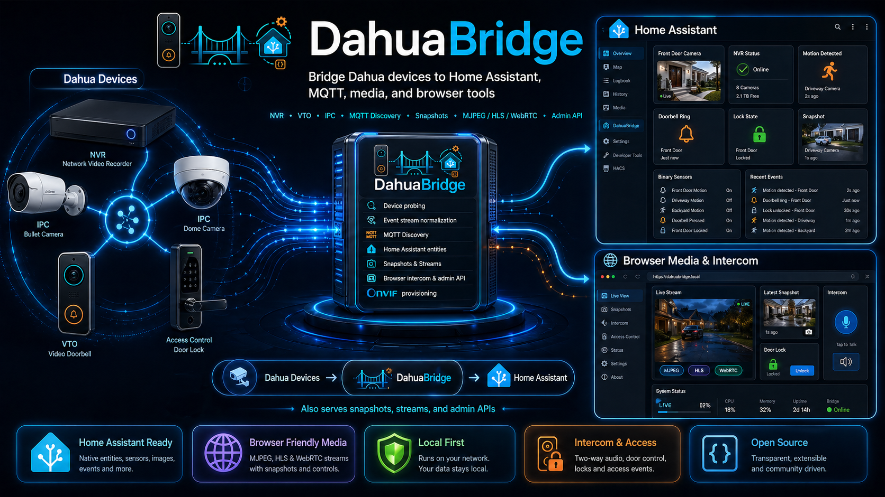

# DahuaBridge

`DahuaBridge` is a Go service that sits between Dahua devices and Home Assistant.
It probes devices, reads event streams, publishes MQTT discovery/state, exposes an admin HTTP API, and serves bridge-hosted media paths for browsers and dashboards.

<p align="center" style="text-align: center;">
  
</p>

## What The Bridge Does

- Probes Dahua `NVR`, `VTO`, and standalone `IPC` devices.
- Collects inventory such as firmware, channels, locks, alarms, disks, and encode metadata.
- Attaches to supported Dahua event streams and normalizes activity into MQTT state and triggers.
- Publishes Home Assistant MQTT discovery for devices, sensors, buttons, and snapshot cameras.
- Exposes a bridge-native Home Assistant catalog endpoint that a companion custom integration can consume for unified per-device camera and sensor grouping.
- Exposes snapshots, stream inventory, and admin APIs over HTTP.
- Serves bridge-hosted `MJPEG`, `HLS`, and playback WebRTC for browser/dashboard use.
- Exposes a dedicated browser intercom page for `VTO` devices with live playback, call state, answer, hangup, and lock actions.
- Exposes bridge-side `VTO` intercom controls into Home Assistant, including answer, hangup, bridge session reset, and optional RTP export enable/disable buttons.
- Can provision Home Assistant ONVIF config entries through the Home Assistant API.
- Persists last known state to disk and restores it on restart when `state_store.enabled=true`.

## What The Bridge Does Not Do Yet

- It does not implement end-to-end VTO talkback.
- It does not implement SIP or VTH emulation.
- It does not yet implement full VTO call acceptance with confirmed talkback/media return.
- Browser microphone uplink can reach the bridge and can be exported as RTP, but that is still not direct VTO talkback.
- Some checklist items still require real-device validation before they can be marked done.

Current project status is tracked in [../docs/project-status.md](../docs/project-status.md).

## High-Level Model

1. Dahua devices are polled and, where supported, event streams are attached.
2. The bridge stores current device state in memory and optionally on disk.
3. MQTT discovery/state is published for Home Assistant.
4. The HTTP API exposes status, devices, events, streams, snapshots, and admin actions.
5. The media layer starts `ffmpeg` workers on demand for browser-friendly playback.

## Requirements

- A reachable MQTT broker.
- Network access from the bridge host to your Dahua devices.
- `ffmpeg` available on the host if media is enabled.
- Home Assistant is optional, but the project is built around it.

## Quick Start

If you want the shortest setup path, read [../docs/install.md](../docs/install.md) first.

1. Copy the example config:

```bash
copy config.example.yaml config.yaml
```

On Linux/macOS:

```bash
cp config.example.yaml config.yaml
```

2. Edit `config.yaml`:

- Set `mqtt.broker`.
- Set device `base_url`, `username`, and `password`.
- Set `home_assistant.public_base_url` to the address Home Assistant and browsers should use to reach the bridge.
- If you want bridge-driven ONVIF provisioning, also set:
  - `home_assistant.api_base_url`
  - `home_assistant.access_token`
- Keep `config.yaml` local. It is intentionally ignored and should not be committed to a public repository.

3. Start the bridge locally:

```bash
go run ./cmd/dahuabridge --config config.yaml
```

The service also respects `DAHUABRIDGE_CONFIG`.

4. Verify that it is alive:

- `GET /healthz`
- `GET /readyz`
- `GET /api/v1/status`
- `GET /api/v1/devices`
- `GET /admin`

5. In Home Assistant:

- Add the MQTT integration if it is not already present.
- Wait for DahuaBridge MQTT-discovered devices and entities to appear.
- If ONVIF provisioning is configured, call:

```text
POST /api/v1/home-assistant/onvif/provision
```

6. For manual stream usage and browser pages, use:

- `GET /api/v1/streams`

That endpoint is the source of truth for:

- snapshot URLs
- RTSP profile variants
- bridge-hosted MJPEG/HLS/WebRTC URLs
- VTO intercom URLs
- ONVIF guidance

## Docker

The repo includes:

- `Dockerfile`
- `Dockerfile.baked`
- `compose.example.yaml`
- `compose.baked.example.yaml`

Container defaults:

- config path: `/config/config.yaml`
- state path: `/data/dahuabridge-state.json`
- listen port: `9205`

Typical flow:

1. Edit `config.yaml`.
2. Mount it to `/config/config.yaml`.
3. Mount a writable `/data` directory.
4. Start with `compose.example.yaml` or your own compose file.

Alternative baked-image flow:

1. Copy `config.example.yaml` to `config.image.yaml`.
2. Put your real config in `config.image.yaml`.
3. Build with `Dockerfile.baked`.
4. Run the container with no config or data mounts.

Notes:

- `config.image.yaml` is ignored by Git.
- This is useful when host-volume permissions are a problem.
- State is then stored in the container writable layer unless your config points elsewhere.

Intel QSV notes:

- The image includes `ffmpeg`, `intel-media-driver`, and `libva-utils`.
- For hardware acceleration, pass `/dev/dri` into the container.
- The container user may also need access to the host `render` / `video` groups.
- `media.input_preset: stable` is the safer choice when RTSP feeds show gray artifacts, freeze bursts, or recover only on keyframes.
- Set `media.video_encoder: qsv` if you want bridge-hosted video work pushed onto Intel QSV where supported:
  `mjpeg_qsv` for MJPEG and `h264_qsv` for HLS / playback WebRTC video.
- If QSV still fails, set `media.hwaccel_args: []` and/or `media.video_encoder: software` to fall back to software decode/transcode.

## Configuration Notes

### `home_assistant.public_base_url`

This should be the bridge URL that Home Assistant and browsers can actually reach.
It is used in generated stream URLs and media pages.

### `home_assistant.api_base_url` and `home_assistant.access_token`

These are only needed if the bridge should create Home Assistant ONVIF config entries for you.

### `home_assistant.camera_snapshot_source`

Controls what the bridge publishes to MQTT-discovered camera snapshot topics during probe refresh:

- `device`: fetch a real snapshot from the camera or NVR
- `logo`: skip device snapshot HTTP calls and publish a built-in placeholder image

Use `logo` if snapshot fetches are slow, noisy, or unreliable and you do not want probe-time snapshot traffic.

### `media.webrtc_ice_servers`

Use this when bridge-hosted WebRTC pages must work across NAT, remote networks, or the public Internet.
Both the browser page and the bridge-side peer connection use this ICE configuration.

### `media.webrtc_uplink_targets`

Optional UDP targets for exporting incoming browser microphone audio from WebRTC intercom sessions.
This exports the received Opus RTP stream from the bridge.
It is useful for future local adapters or experiments, but it is not direct VTO talkback by itself.

Example:

```yaml
media:
  webrtc_uplink_targets:
    - udp://127.0.0.1:5004
    - 127.0.0.1:5006
```

### `media.video_encoder`

Controls the video encoder used by bridge-hosted `MJPEG`, `HLS`, and playback `WebRTC` ffmpeg workers:

- `software`: use CPU codecs (`mjpeg` / `libx264`)
- `qsv`: use Intel QSV video encode when the hardware acceleration path is active (`mjpeg_qsv` / `h264_qsv`)

If `qsv` is selected but the worker falls back to a non-hardware retry, the bridge automatically reverts that retry to software codecs.

### `media.scale_width`

This is the only bridge scaling setting now.

- `0`: keep the source resolution
- non-zero: the bridge reads the source dimensions from the stream catalog, computes an even output height that preserves aspect ratio, and passes both width and height to ffmpeg

This keeps the software and QSV paths aligned and avoids the fragile `auto height` behavior some QSV stacks reject.

### `media.input_preset`

Controls the ffmpeg RTSP input flags used by bridge-hosted `MJPEG`, `HLS`, and playback `WebRTC` workers:

- `low_latency`: uses aggressive low-latency ffmpeg input flags
- `stable`: removes those low-latency flags and keeps corruption discard enabled

For `MJPEG` and `HLS`, the bridge now retries in this order when a worker start fails:

1. configured mode with hardware acceleration
2. configured mode without hardware acceleration
3. `stable` mode without hardware acceleration

That gives you an automatic escape path from brittle `QSV` or low-latency RTSP behavior without changing the primary config every time.

### `media.frame_rate`, `media.stable_frame_rate`, and `media.substream_frame_rate`

These control the bridge output frame rate by profile family:

- `frame_rate`: main-stream `default` / `quality`
- `stable_frame_rate`: `stable`
- `substream_frame_rate`: `substream`

This lets you keep conservative substream previews while driving higher-rate live views from `quality`, or raise `stable` without changing the main-stream defaults.

### `state_store`

When enabled, the bridge restores prior state on startup and republishes it before fresh probes complete.

## Home Assistant Setup

### Automatic MQTT Side

The bridge automatically publishes MQTT discovery for:

- Dahua root devices
- supported child devices such as NVR channels, VTO locks, and VTO alarms
- sensors and binary sensors
- snapshot cameras
- VTO lock buttons
- VTO answer button
- VTO hangup button
- VTO bridge session reset button
- VTO RTP export enable/disable buttons when uplink targets are configured
- device triggers for supported activity

### Bridge-Native Custom Integration

If you want one Home Assistant device such as `nvr_channel_01` to contain the camera plus its related motion, AI, and state entities, use the companion Home Assistant custom integration.

In this repository it lives at:

- `../integration/custom_components/dahuabridge`

That integration consumes:

- `GET /api/v1/home-assistant/native/catalog`

and keeps camera, sensors, and supported `VTO` action buttons under the same Home Assistant integration instead of mixing MQTT discovery with separate ONVIF or Generic Camera entries.

Install flow:

1. Copy the `dahuabridge` custom component into your Home Assistant `custom_components` directory as `custom_components/dahuabridge`.
2. Restart Home Assistant.
3. Add the `DahuaBridge` integration from the UI and point it at the bridge base URL.

Current characteristics:

- best fit for unified `NVR channel`, `IPC`, and `VTO` device views
- bridge-native camera plus related state/button entities
- polling-based first slice, not MQTT push-based yet
- meant for users who care more about one clean HA device per streamable thing than about ONVIF-native camera entities
- for the cleanest Home Assistant entity list, set `home_assistant.entity_mode: native` and then call `POST /api/v1/home-assistant/mqtt/discovery/remove` once

### ONVIF Provisioning

If the Home Assistant API is configured, the bridge can request ONVIF config-entry creation for eligible devices.

Use:

```text
POST /api/v1/home-assistant/onvif/provision
```

If you are moving to the bridge-native integration as the primary Home Assistant path, also review:

- `GET /api/v1/home-assistant/migration/plan`
- `GET /api/v1/home-assistant/migration/guide.md`
- `POST /api/v1/home-assistant/mqtt/discovery/remove`

### Streams And Browser Use

Use:

```text
GET /api/v1/streams
```

Each stream entry may include:

- `snapshot_url`
- `profiles.default`
- `profiles.quality`
- `profiles.stable`
- `profiles.substream`
- `profiles.*.local_mjpeg_url`
- `profiles.*.local_hls_url`
- `profiles.*.local_webrtc_url`
- `local_preview_url`
- `local_intercom_url` for `VTO`
- `intercom` capability and call-session metadata for `VTO`
  - answer URL
  - hangup URL
  - bridge session reset URL
  - lock action URLs
  - external uplink enable/disable URLs
- ONVIF recommendation fields

For the bridge-native custom integration, also use:

- `GET /api/v1/home-assistant/native/catalog`

### Browser Pages

- `GET /api/v1/media/preview/{streamID}`
  - browser/mobile preview page
  - prefers native HLS, falls back to MJPEG

- `GET /api/v1/media/webrtc/{streamID}/{profile}`
  - low-latency playback WebRTC page
  - playback only
  - automatic reconnect on browser-side disconnects

- `GET /api/v1/vto/{deviceID}/intercom`
  - VTO-specific page
  - live playback
  - call-state refresh
  - answer
  - bridge-side session status
  - bridge-side session reset
  - automatic media reconnect after browser-side disconnects
  - hangup
  - lock actions
  - browser microphone uplink
  - optional external RTP export if configured
  - external export enable/disable control if configured

## Main HTTP API

### Health And Status

- `GET /admin`
- `GET /healthz`
- `GET /readyz`
- `GET /metrics`
- `GET /api/v1/status`
- `GET /api/v1/home-assistant/native/catalog`

### Device Inventory

- `GET /api/v1/devices`
- `GET /api/v1/devices/{deviceID}`
- `POST /api/v1/devices/probe-all`
- `POST /api/v1/devices/{deviceID}/probe`
- `POST /api/v1/devices/{deviceID}/credentials`
- `POST /api/v1/nvr/{deviceID}/inventory/refresh`

### Events

- `GET /api/v1/events`
- `DELETE /api/v1/events`

### Streams And Media

- `GET /api/v1/streams`
- `GET /api/v1/streams/{streamID}`
- `GET /api/v1/media/workers`
- `GET /api/v1/media/preview/{streamID}`
- `GET /api/v1/media/mjpeg/{streamID}`
- `GET /api/v1/media/hls/{streamID}/{profile}/index.m3u8`
- `GET /api/v1/media/webrtc/{streamID}/{profile}`
- `POST /api/v1/media/webrtc/{streamID}/{profile}/offer`

### Snapshots

- `GET /api/v1/nvr/{deviceID}/channels/{channel}/snapshot`
- `GET /api/v1/vto/{deviceID}/snapshot`
- `GET /api/v1/ipc/{deviceID}/snapshot`

### VTO Actions

- `POST /api/v1/vto/{deviceID}/locks/{lockIndex}/unlock`
- `POST /api/v1/vto/{deviceID}/call/answer`
- `POST /api/v1/vto/{deviceID}/call/hangup`
- `GET /api/v1/vto/{deviceID}/intercom`
- `GET /api/v1/vto/{deviceID}/intercom/status`
- `POST /api/v1/vto/{deviceID}/intercom/reset`
- `POST /api/v1/vto/{deviceID}/intercom/uplink/enable`
- `POST /api/v1/vto/{deviceID}/intercom/uplink/disable`

### Home Assistant Helpers

- `GET /api/v1/home-assistant/package/cameras.yaml`
- `GET /api/v1/home-assistant/package/cameras_stable.yaml`
- `GET /api/v1/home-assistant/package/cameras_quality.yaml`
- `GET /api/v1/home-assistant/package/cameras_substream.yaml`
- `GET /api/v1/home-assistant/package/cameras_dashboard.yaml`
- `GET /api/v1/home-assistant/dashboard/lovelace.yaml`
- `POST /api/v1/home-assistant/onvif/provision`

## Stream Profiles

The bridge generates four RTSP profile variants:

- `default`: main stream, minimal changes
- `quality`: main stream, bridge-recommended for quality-first use
- `stable`: substream, TCP, lower frame-rate bias
- `substream`: explicit subtype=1 variant

Current recommendation logic:

- prefer `stable` for heavier main streams such as `H.265/HEVC` or higher-than-`1080p`
- otherwise prefer `quality`

## Media Layer Notes

- `MJPEG` is the simplest dashboard path.
- `HLS` is the browser-native path and carries `AAC` when source audio exists.
- WebRTC playback carries `Opus` when source audio exists.
- Browser microphone audio can enter the bridge and be exported as RTP.
- Home Assistant can trigger VTO answer/hangup, bridge session reset, and RTP export enable/disable through MQTT-discovered buttons.
- The bridge still does not provide full end-to-end intercom media to the VTO.

## Current Honest Limits

- `VTO` answer and hangup exist, but full accepted-call media/talkback still does not.
- Unlock transport exists, but final physical validation still depends on real hardware.
- Browser mic uplink exists, but direct VTO talkback does not.
- Full SIP/call-control support is still open.
- The bridge-native Home Assistant custom integration is a first slice: it unifies devices, but currently polls bridge state instead of consuming MQTT push updates directly.
- Some firmware-variant coverage is still pending wider live validation.

## Project Status

For implementation status, open tasks, and what is truly done, use:

- [../docs/project-status.md](../docs/project-status.md)
